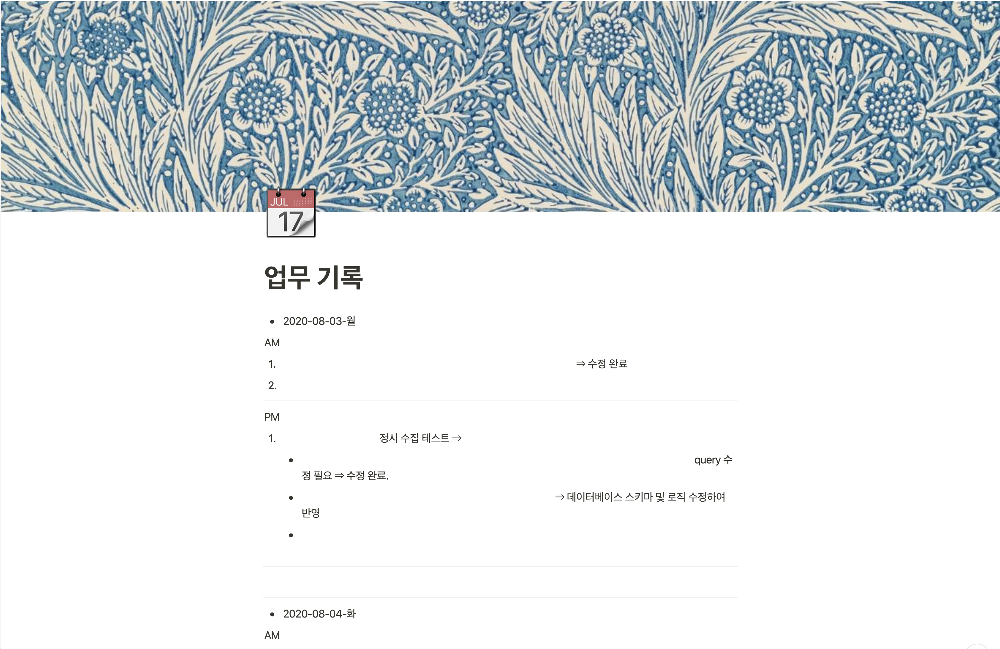
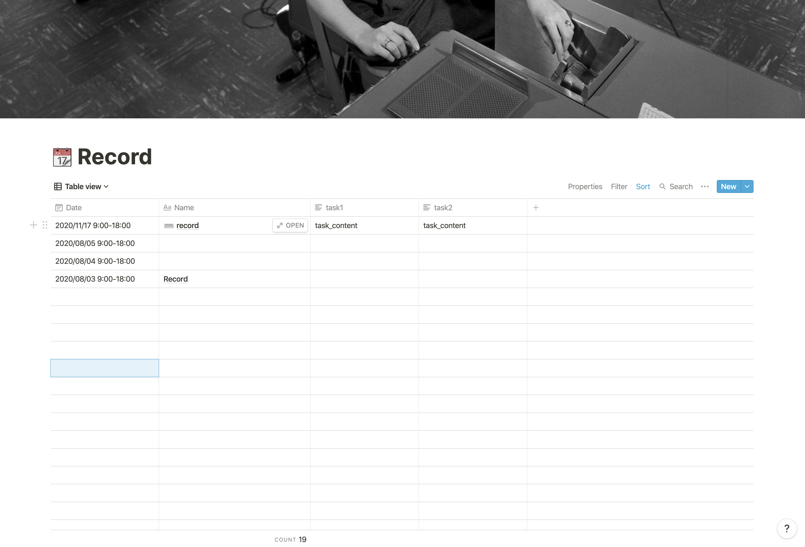

# Python Toy project

## Notion 업무일지 마이그레이션 툴

```
업무일지는 20년 8월부터 하루도 오늘(20년 11월 17일)빠짐없이 작성중인데 기존에 정해진 양식없이 쓰기만 급급하여 보기가 안좋았습니다. 그래서 notion에서 제공하는 table 탬플릿을 사용해 보기 좋게 바꿔보려 합니다. 하지만 이전 세달치 데이터를 복/붙으로 한땀 한땀 옮겨 쓰기엔 시간이 아깝단 생각이 들었습니다.
그래서 이 작업을 대신해줄 프로그램을 파이썬으로 작성해보기로 했습니다.

```

> 참고 1.<https://velog.io/@king/Notion-API-%ED%98%B8%EC%B6%9C%EB%A1%9C-TodoBlock-%EC%B6%94%EA%B0%80%ED%95%98%EA%B8%B0-6pk58z0kqm>  
> 참고 2.<https://medium.com/@leejukyung/notion-py%EB%A1%9C-%EC%9E%90%EB%8F%99%EC%9C%BC%EB%A1%9C-%ED%8E%98%EC%9D%B4%EC%A7%80%EC%99%80-%ED%85%8C%EC%9D%B4%EB%B8%94-%EB%A7%8C%EB%93%A4%EA%B8%B0-5b685e8c8a5d>

#### BEFORE



#### AFTER


